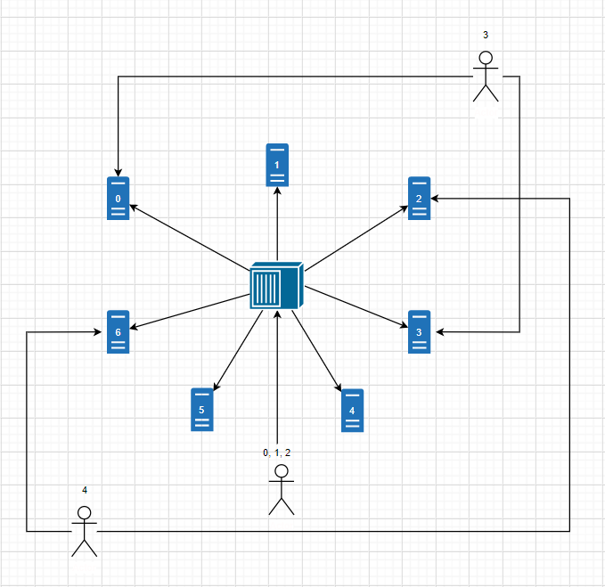

# Byzantine Project Documentation

# Preface

This document is written in Markdown. To view the rendered version, you can use your tool of choice. Followings are tools that I prefer:

1. [SublimeText](https://www.sublimetext.com/3) with [Markdown​Preview](https://packagecontrol.io/packages/MarkdownPreview) plugin
2. [VS Code](https://code.visualstudio.com/download) (it has MarkdownPreview built-in)

# Implementation

This project's communication protocol implements [Lamport's clock](https://en.wikipedia.org/wiki/Lamport_timestamps) to ensure distributed synchronization. _Some additional details regarding behaviors will be further addressed in the [Test plan](#test-plan) section below._

## Server communication

When a server starts, it tries to connect to all of its peers (supplied in as parameters).

It then creates 2 threads and does the following:
1. Tries to open socket to other servers (its peers)
2. Accepts new connection request (either from other servers or from clients)

Upon accepting new open socket, the server creates new thread per connection to handle them all concurrently (non-blocking from each other).

For any message the server receives, it then updates its local time to ensure the local time is no smaller than the timestamp of the message (per Lamport's logic). After it finishes processing a message, the server also increments its local time to advance the clock.

If the server needs to write to the file, it _has to talk to other servers to ensure mutually synchronized_ by doing the followings:
1. Sends a Write Acquire Request message to every servers and put the message onto its queue
2. Waits for all Write Acquire Response message from every other servers regarding the request it just sent
3. Proceeds to critical section (write to the file)
4. Sends a Write Release Request to every servers to free the lock
5. Exits critical section

The logic above is proven by Lamport's paper: _L. Lamport. Time, Clocks and the Ordering of Events in a Distributed System. Communications of the ACM, 21(7):558–565, July 1978._

## Client communication

When a client starts, it tries to create sockets to connect to all servers. Since the [hash function](#hash-function) will calculate the index from 0 to 6, it is required that all 7 servers must be supplied as parameters to the client, regardless if they are reachable or not. This requirement is necessary to allow correctness in requesting later.

Then in a loop, it does the following:
1. Randomly decides if should read or write
2. Randomly decides the file number
3. Runs the [algorithm](#hash-function) below to choose which server(s) to send request to
4. Displays server's response or error message

Since at any given time the client only needs to do one thing (send either read or write request), it does not need multiple threads to handle any of its workflow. So the execution path is top down.

Before sending any message, the client increments its local time to advance the clock. For any message the client receives, it then updates its local time to ensure the local time is no smaller than the timestamp of the message (per Lamport's logic).

## Hash function
Per this requirements:
> There exists a hash function, H, such that for each object, Ok, H(Ok) yields a value in the range 0 - 6

The client implements this hash function by given a (object) number n, its hash value is `H(n) = n mod 7`. This ensures the hash value of the object is always between 0 and 6 to fit the 7 servers.

Per this requirement:
> Compute 3 servers numbered: H(Ok), H(Ok)+1 modulo 7, and H(Ok)+2 modulo 7

The client simply uses the value `H(n)` from above to come up with these hashes per servers respectively: `H(n)`, `(H(n) + 1) mod 7`, and `(H(n) + 2) mod 7`

# Test plan

Since the workflow complexity of this project is relatively high due to the amount of distinct moving parts (7 servers and 5 clients, each supports multiple flows), it is quite hard trying to test everything together. So in this test plan, I will break down the flows by directly modify some flags of the code to restrict to only 1 path at a time, prove that part works, then move on to the next. Finally, I will let everything run as of production code would, and show the final outputs from a couple of clients' and servers' consoles as well as output files.

## Single client reads

For this flow, I want the client to only requests random read from different servers. The files may or may not exist yet. 

[ClientNode](../Client/src/main/java/ClientNode.java):

Turn on Debug mode by the following setting:
```java
private final boolean IS_DEBUGGING = true;
private Logger logger = new Logger(Logger.LogLevel.Debug);
```

Limit the flow to read-only and the file randomness:
```java
if (IS_DEBUGGING) {
    needToWrite = false;
    fileNumber = random.nextInt(4);
}
```

[ServerNode](../Server/src/main/java/ServerNode.java):

Turn on Debug mode by the following setting:
```java
private Logger logger = new Logger(Logger.LogLevel.Debug);
```

Follow [these steps](../README.md#how-to-run) to build and run.

For this test case, I choose _client0_ to connect and read from different servers. I only spin up odd servers (1, 3, 5) and leave the even ones off so that _client0_ won't be able to connect to them. In each of these servers' file directory, I have prepared the following files:
1. File1.txt: `Server1 File1 Line1`
2. File3.txt: `Server1 File3 Line1`

_Sample client's console:_
```text
> client0 starts at time: 2020-03-16 at 14:51:38.841 CDT
> client0 sends 'client0|ClientReadRequest|1|File1.txt' to server1 at time: 2020-03-16 at 14:51:38.867 CDT
> client0 receives 'server1|ReadSuccessAck|3|Server1 File1 Line1' from server1 at time: 2020-03-16 at 14:51:38.873 CDT
> client0 sends 'client0|ClientReadRequest|6|File7.txt' to server1 at time: 2020-03-16 at 14:51:39.354 CDT
> client0 receives 'server1|ReadFailureAck|8|File 'File7.txt' does not exist' from server1 at time: 2020-03-16 at 14:51:39.355 CDT
> client0: server1 cannot find file 'File7.txt' at time: 2020-03-16 at 14:51:39.355 CDT
> client0 sends 'client0|ClientReadRequest|11|File5.txt' to server5 at time: 2020-03-16 at 14:51:39.598 CDT
> client0 receives 'server5|ReadFailureAck|13|File 'File5.txt' does not exist' from server5 at time: 2020-03-16 at 14:51:39.601 CDT
> client0: server5 cannot find file 'File5.txt' at time: 2020-03-16 at 14:51:39.601 CDT
> client0: server6 is unreachable to read file 'File4.txt' at time: 2020-03-16 at 14:51:39.816 CDT
> client0 sends 'client0|ClientReadRequest|16|File4.txt' to server5 at time: 2020-03-16 at 14:51:39.816 CDT
> client0 receives 'server5|ReadFailureAck|18|File 'File4.txt' does not exist' from server5 at time: 2020-03-16 at 14:51:39.817 CDT
> client0: server5 cannot find file 'File4.txt' at time: 2020-03-16 at 14:51:39.817 CDT
> client0 sends 'client0|ClientReadRequest|21|File2.txt' to server3 at time: 2020-03-16 at 14:51:40.125 CDT
> client0 receives 'server3|ReadFailureAck|23|File 'File2.txt' does not exist' from server3 at time: 2020-03-16 at 14:51:40.128 CDT
> client0: server3 cannot find file 'File2.txt' at time: 2020-03-16 at 14:51:40.129 CDT
> client0 sends 'client0|ClientReadRequest|26|File5.txt' to server5 at time: 2020-03-16 at 14:51:40.554 CDT
> client0 receives 'server5|ReadFailureAck|28|File 'File5.txt' does not exist' from server5 at time: 2020-03-16 at 14:51:40.555 CDT
> client0: server5 cannot find file 'File5.txt' at time: 2020-03-16 at 14:51:40.555 CDT
> client0 sends 'client0|ClientReadRequest|31|File1.txt' to server1 at time: 2020-03-16 at 14:51:40.965 CDT
> client0 receives 'server1|ReadSuccessAck|33|Server1 File1 Line1' from server1 at time: 2020-03-16 at 14:51:40.967 CDT
> client0: server0 is unreachable to read file 'File7.txt' at time: 2020-03-16 at 14:51:41.142 CDT
> client0 sends 'client0|ClientReadRequest|36|File7.txt' to server1 at time: 2020-03-16 at 14:51:41.143 CDT
> client0 receives 'server1|ReadFailureAck|38|File 'File7.txt' does not exist' from server1 at time: 2020-03-16 at 14:51:41.144 CDT
> client0: server1 cannot find file 'File7.txt' at time: 2020-03-16 at 14:51:41.144 CDT
> client0: server2 is unreachable to read file 'File9.txt' at time: 2020-03-16 at 14:51:41.428 CDT
> client0 sends 'client0|ClientReadRequest|41|File9.txt' to server3 at time: 2020-03-16 at 14:51:41.429 CDT
> client0 receives 'server3|ReadFailureAck|43|File 'File9.txt' does not exist' from server3 at time: 2020-03-16 at 14:51:41.430 CDT
> client0: server3 cannot find file 'File9.txt' at time: 2020-03-16 at 14:51:41.430 CDT
> client0: server0 is unreachable to read file 'File5.txt' at time: 2020-03-16 at 14:51:41.430 CDT
> client0: server6 is unreachable to read file 'File5.txt' at time: 2020-03-16 at 14:51:41.430 CDT
> client0 sends 'client0|ClientReadRequest|46|File5.txt' to server5 at time: 2020-03-16 at 14:51:41.431 CDT
> client0 receives 'server5|ReadFailureAck|48|File 'File5.txt' does not exist' from server5 at time: 2020-03-16 at 14:51:41.432 CDT
> client0: server5 cannot find file 'File5.txt' at time: 2020-03-16 at 14:51:41.432 CDT
> client0 sends 'client0|ClientReadRequest|51|File3.txt' to server5 at time: 2020-03-16 at 14:51:41.891 CDT
> client0 receives 'server5|ReadSuccessAck|53|Server1 File3 Line1' from server5 at time: 2020-03-16 at 14:51:41.896 CDT
> client0 sends 'client0|ClientReadRequest|56|File0.txt' to server1 at time: 2020-03-16 at 14:51:42.238 CDT
> client0 receives 'server1|ReadFailureAck|58|File 'File0.txt' does not exist' from server1 at time: 2020-03-16 at 14:51:42.239 CDT
> client0: server1 cannot find file 'File0.txt' at time: 2020-03-16 at 14:51:42.239 CDT
> client0 sends 'client0|ClientReadRequest|61|File7.txt' to server1 at time: 2020-03-16 at 14:51:42.266 CDT
> client0 receives 'server1|ReadFailureAck|63|File 'File7.txt' does not exist' from server1 at time: 2020-03-16 at 14:51:42.267 CDT
> client0: server1 cannot find file 'File7.txt' at time: 2020-03-16 at 14:51:42.267 CDT
> client0 sends 'client0|ClientReadRequest|66|File6.txt' to server1 at time: 2020-03-16 at 14:51:42.304 CDT
> client0 receives 'server1|ReadFailureAck|68|File 'File6.txt' does not exist' from server1 at time: 2020-03-16 at 14:51:42.305 CDT
> client0: server1 cannot find file 'File6.txt' at time: 2020-03-16 at 14:51:42.305 CDT
> client0: server6 is unreachable to read file 'File6.txt' at time: 2020-03-16 at 14:51:42.472 CDT
> client0: server0 is unreachable to read file 'File6.txt' at time: 2020-03-16 at 14:51:42.472 CDT
> client0 sends 'client0|ClientReadRequest|71|File6.txt' to server1 at time: 2020-03-16 at 14:51:42.473 CDT
> client0 receives 'server1|ReadFailureAck|73|File 'File6.txt' does not exist' from server1 at time: 2020-03-16 at 14:51:42.474 CDT
> client0: server1 cannot find file 'File6.txt' at time: 2020-03-16 at 14:51:42.474 CDT
> client0: server2 is unreachable to read file 'File1.txt' at time: 2020-03-16 at 14:51:42.822 CDT
> client0 sends 'client0|ClientReadRequest|76|File1.txt' to server3 at time: 2020-03-16 at 14:51:42.822 CDT
> client0 receives 'server3|ReadSuccessAck|78|Server1 File1 Line1' from server3 at time: 2020-03-16 at 14:51:42.826 CDT
> client0: server2 is unreachable to read file 'File8.txt' at time: 2020-03-16 at 14:51:43.292 CDT
> client0 sends 'client0|ClientReadRequest|81|File8.txt' to server3 at time: 2020-03-16 at 14:51:43.293 CDT
> client0 receives 'server3|ReadFailureAck|83|File 'File8.txt' does not exist' from server3 at time: 2020-03-16 at 14:51:43.294 CDT
> client0: server3 cannot find file 'File8.txt' at time: 2020-03-16 at 14:51:43.294 CDT
> client0 sends 'client0|ClientReadRequest|86|File7.txt' to server1 at time: 2020-03-16 at 14:51:43.395 CDT
> client0 receives 'server1|ReadFailureAck|88|File 'File7.txt' does not exist' from server1 at time: 2020-03-16 at 14:51:43.396 CDT
> client0: server1 cannot find file 'File7.txt' at time: 2020-03-16 at 14:51:43.396 CDT
> client0: server4 is unreachable to read file 'File9.txt' at time: 2020-03-16 at 14:51:43.497 CDT
> client0 sends 'client0|ClientReadRequest|91|File9.txt' to server3 at time: 2020-03-16 at 14:51:43.498 CDT
> client0 receives 'server3|ReadFailureAck|93|File 'File9.txt' does not exist' from server3 at time: 2020-03-16 at 14:51:43.499 CDT
> client0: server3 cannot find file 'File9.txt' at time: 2020-03-16 at 14:51:43.499 CDT
> client0: server2 is unreachable to read file 'File2.txt' at time: 2020-03-16 at 14:51:43.673 CDT
> client0: server4 is unreachable to read file 'File2.txt' at time: 2020-03-16 at 14:51:43.673 CDT
> client0 sends 'client0|ClientReadRequest|96|File2.txt' to server3 at time: 2020-03-16 at 14:51:43.673 CDT
> client0 receives 'server3|ReadFailureAck|98|File 'File2.txt' does not exist' from server3 at time: 2020-03-16 at 14:51:43.674 CDT
> client0: server3 cannot find file 'File2.txt' at time: 2020-03-16 at 14:51:43.674 CDT
> client0 gracefully exits at time: 2020-03-16 at 14:51:43.674 CDT
```

When a client randomly select 1 out of 3 possible servers to send read request, if that server is unreachable, then the client proceeds to the next server to issue request until it runs out of all servers (all are unreachable) then it will display an error message. If any of the 3 servers is reachable to handle the read request, the client will display the result of that server - regardless of the response of that server: Success acknowledgement means the file exists and can read (return along with the its content), Failure acknowledgement means the file does not exist to read.

_Sample server's console:_
```text
> server3 starts listening on (localhost:1373)... at time: 2020-03-16 at 14:50:40.910 CDT
> server3 receives new request from Socket[addr=/127.0.0.1,port=64452,localport=1373] at time: 2020-03-16 at 14:51:26.619 CDT
> server3 receives 'client0|ClientReadRequest|21|File2.txt' from client0 at time: 2020-03-16 at 14:51:40.127 CDT
> server3 sends 'server3|ReadFailureAck|23|File 'File2.txt' does not exist' to client0 at time: 2020-03-16 at 14:51:40.128 CDT
> server3 receives 'client0|ClientReadRequest|41|File9.txt' from client0 at time: 2020-03-16 at 14:51:41.429 CDT
> server3 sends 'server3|ReadFailureAck|43|File 'File9.txt' does not exist' to client0 at time: 2020-03-16 at 14:51:41.429 CDT
> server3 receives 'client0|ClientReadRequest|76|File1.txt' from client0 at time: 2020-03-16 at 14:51:42.822 CDT
> server3 sends 'server3|ReadSuccessAck|78|Server1 File1 Line1' to client0 at time: 2020-03-16 at 14:51:42.825 CDT
> server3 receives 'client0|ClientReadRequest|81|File8.txt' from client0 at time: 2020-03-16 at 14:51:43.293 CDT
> server3 sends 'server3|ReadFailureAck|83|File 'File8.txt' does not exist' to client0 at time: 2020-03-16 at 14:51:43.293 CDT
> server3 receives 'client0|ClientReadRequest|91|File9.txt' from client0 at time: 2020-03-16 at 14:51:43.498 CDT
> server3 sends 'server3|ReadFailureAck|93|File 'File9.txt' does not exist' to client0 at time: 2020-03-16 at 14:51:43.498 CDT
> server3 receives 'client0|ClientReadRequest|96|File2.txt' from client0 at time: 2020-03-16 at 14:51:43.673 CDT
> server3 sends 'server3|ReadFailureAck|98|File 'File2.txt' does not exist' to client0 at time: 2020-03-16 at 14:51:43.674 CDT
```

When a server receives a client's read request for a particular file, if the file exists in its file system then the server sends a success acknowledgement that contains the content of the file back to the client; otherwise it sends a failure acknowledgement back.

Note that in this example, a single client reads multiple servers. But spinning up other client instances will not affect the read behavior because the servers do not have to talk to each other when receiving the read request (see protocol above).

## Single client writes

For this flow, I want the client to only requests random write from different servers. The files may or may not exist yet. If the file being requested does not exist, the server will automatically create the file before writing to it.

[ClientNode](../Client/src/main/java/ClientNode.java):

Turn on Debug mode by the following setting:
```java
private final boolean IS_DEBUGGING = true;
private Logger logger = new Logger(Logger.LogLevel.Debug);
```

Limit the flow to write-only and the file randomness:
```java
if (IS_DEBUGGING) {
    needToWrite = false;
    fileNumber = random.nextInt(4);
}
```

[ServerNode](../Server/src/main/java/ServerNode.java):

Turn on Debug mode by the following setting:
```java
private Logger logger = new Logger(Logger.LogLevel.Debug);
```

Follow [these steps](../README.md#how-to-run) to build and run.

For this test case, I choose _client0_ to connect and write to different servers (1, 2, 3) and leave the rest off so that _client0_ won't be able to connect to them.

_Sample client's console:_
```text
> client0 successfully connects to 3 server(s): (server1, server2, server3) at time: 2020-03-16 at 17:14:22.626 CDT
> client0 starts at time: 2020-03-16 at 17:14:22.626 CDT
> client0: Cannot write to 'File6.txt' because of too many (2) unreachable servers (server6, server0) at time: 2020-03-16 at 17:14:22.956 CDT
> client0: Cannot write to 'File4.txt' because of too many (3) unreachable servers (server4, server5, server6) at time: 2020-03-16 at 17:14:23.053 CDT
> client0 sends 'client0|ClientWriteRequest|1|File7.txt|client0 message #2' to server1 at time: 2020-03-16 at 17:14:23.412 CDT
> client0 receives 'server1|WriteSuccessAck|12|' from server1 at time: 2020-03-16 at 17:14:23.424 CDT
> client0 sends 'client0|ClientWriteRequest|15|File7.txt|client0 message #2' to server2 at time: 2020-03-16 at 17:14:23.424 CDT
> client0 receives 'server2|WriteSuccessAck|26|' from server2 at time: 2020-03-16 at 17:14:23.436 CDT
> client0: Cannot write to 'File4.txt' because of too many (3) unreachable servers (server4, server5, server6) at time: 2020-03-16 at 17:14:23.834 CDT
> client0: Cannot write to 'File6.txt' because of too many (2) unreachable servers (server6, server0) at time: 2020-03-16 at 17:14:24.278 CDT
> client0 sends 'client0|ClientWriteRequest|29|File7.txt|client0 message #5' to server1 at time: 2020-03-16 at 17:14:24.672 CDT
> client0 receives 'server1|WriteSuccessAck|40|' from server1 at time: 2020-03-16 at 17:14:24.778 CDT
> client0 sends 'client0|ClientWriteRequest|43|File7.txt|client0 message #5' to server2 at time: 2020-03-16 at 17:14:24.779 CDT
> client0 receives 'server2|WriteSuccessAck|54|' from server2 at time: 2020-03-16 at 17:14:24.884 CDT
> client0: Cannot write to 'File3.txt' because of too many (2) unreachable servers (server4, server5) at time: 2020-03-16 at 17:14:24.979 CDT
> client0 sends 'client0|ClientWriteRequest|57|File0.txt|client0 message #7' to server1 at time: 2020-03-16 at 17:14:25.341 CDT
> client0 receives 'server1|WriteSuccessAck|68|' from server1 at time: 2020-03-16 at 17:14:25.446 CDT
> client0 sends 'client0|ClientWriteRequest|71|File0.txt|client0 message #7' to server2 at time: 2020-03-16 at 17:14:25.446 CDT
> client0 receives 'server2|WriteSuccessAck|82|' from server2 at time: 2020-03-16 at 17:14:25.551 CDT
> client0 sends 'client0|ClientWriteRequest|85|File2.txt|client0 message #8' to server2 at time: 2020-03-16 at 17:14:25.672 CDT
> client0 receives 'server2|WriteSuccessAck|96|' from server2 at time: 2020-03-16 at 17:14:25.776 CDT
> client0 sends 'client0|ClientWriteRequest|99|File2.txt|client0 message #8' to server3 at time: 2020-03-16 at 17:14:25.776 CDT
> client0 receives 'server3|WriteSuccessAck|110|' from server3 at time: 2020-03-16 at 17:14:25.782 CDT
> client0: Cannot write to 'File6.txt' because of too many (2) unreachable servers (server6, server0) at time: 2020-03-16 at 17:14:25.866 CDT
> client0: Cannot write to 'File6.txt' because of too many (2) unreachable servers (server6, server0) at time: 2020-03-16 at 17:14:26.002 CDT
> client0 sends 'client0|ClientWriteRequest|113|File9.txt|client0 message #11' to server2 at time: 2020-03-16 at 17:14:26.443 CDT
> client0 receives 'server2|WriteSuccessAck|124|' from server2 at time: 2020-03-16 at 17:14:26.546 CDT
> client0 sends 'client0|ClientWriteRequest|127|File9.txt|client0 message #11' to server3 at time: 2020-03-16 at 17:14:26.546 CDT
> client0 receives 'server3|WriteSuccessAck|138|' from server3 at time: 2020-03-16 at 17:14:26.651 CDT
> client0: Cannot write to 'File3.txt' because of too many (2) unreachable servers (server4, server5) at time: 2020-03-16 at 17:14:26.961 CDT
> client0: Cannot write to 'File5.txt' because of too many (3) unreachable servers (server5, server6, server0) at time: 2020-03-16 at 17:14:27.026 CDT
> client0 sends 'client0|ClientWriteRequest|141|File8.txt|client0 message #14' to server1 at time: 2020-03-16 at 17:14:27.206 CDT
> client0 receives 'server1|WriteSuccessAck|152|' from server1 at time: 2020-03-16 at 17:14:27.312 CDT
> client0 sends 'client0|ClientWriteRequest|155|File8.txt|client0 message #14' to server2 at time: 2020-03-16 at 17:14:27.313 CDT
> client0 receives 'server2|WriteSuccessAck|166|' from server2 at time: 2020-03-16 at 17:14:27.414 CDT
> client0 sends 'client0|ClientWriteRequest|169|File8.txt|client0 message #14' to server3 at time: 2020-03-16 at 17:14:27.415 CDT
> client0 receives 'server3|WriteSuccessAck|180|' from server3 at time: 2020-03-16 at 17:14:27.518 CDT
> client0 sends 'client0|ClientWriteRequest|183|File2.txt|client0 message #15' to server2 at time: 2020-03-16 at 17:14:27.764 CDT
> client0 receives 'server2|WriteSuccessAck|194|' from server2 at time: 2020-03-16 at 17:14:27.867 CDT
> client0 sends 'client0|ClientWriteRequest|197|File2.txt|client0 message #15' to server3 at time: 2020-03-16 at 17:14:27.867 CDT
> client0 receives 'server3|WriteSuccessAck|208|' from server3 at time: 2020-03-16 at 17:14:27.970 CDT
> client0 sends 'client0|ClientWriteRequest|211|File8.txt|client0 message #16' to server1 at time: 2020-03-16 at 17:14:28.349 CDT
> client0 receives 'server1|WriteSuccessAck|222|' from server1 at time: 2020-03-16 at 17:14:28.451 CDT
> client0 sends 'client0|ClientWriteRequest|225|File8.txt|client0 message #16' to server2 at time: 2020-03-16 at 17:14:28.452 CDT
> client0 receives 'server2|WriteSuccessAck|236|' from server2 at time: 2020-03-16 at 17:14:28.554 CDT
> client0 sends 'client0|ClientWriteRequest|239|File8.txt|client0 message #16' to server3 at time: 2020-03-16 at 17:14:28.554 CDT
> client0 receives 'server3|WriteSuccessAck|250|' from server3 at time: 2020-03-16 at 17:14:28.656 CDT
> client0: Cannot write to 'File5.txt' because of too many (3) unreachable servers (server5, server6, server0) at time: 2020-03-16 at 17:14:28.940 CDT
> client0 sends 'client0|ClientWriteRequest|253|File1.txt|client0 message #18' to server1 at time: 2020-03-16 at 17:14:29.171 CDT
> client0 receives 'server1|WriteSuccessAck|264|' from server1 at time: 2020-03-16 at 17:14:29.275 CDT
> client0 sends 'client0|ClientWriteRequest|267|File1.txt|client0 message #18' to server2 at time: 2020-03-16 at 17:14:29.275 CDT
> client0 receives 'server2|WriteSuccessAck|278|' from server2 at time: 2020-03-16 at 17:14:29.379 CDT
> client0 sends 'client0|ClientWriteRequest|281|File1.txt|client0 message #18' to server3 at time: 2020-03-16 at 17:14:29.379 CDT
> client0 receives 'server3|WriteSuccessAck|292|' from server3 at time: 2020-03-16 at 17:14:29.488 CDT
> client0: Cannot write to 'File6.txt' because of too many (2) unreachable servers (server6, server0) at time: 2020-03-16 at 17:14:29.822 CDT
> client0 gracefully exits at time: 2020-03-16 at 17:14:29.822 CDT
```

When _client0_ tries to write to _File6.txt_, it should connects to _server6_, _server0_, and _server1_ according to the [hash function](#hash-function) implemented above. But since it can only connect to _server1_, the write is not permitted. Same situation applied when _client0_ tries to write to _File4.txt_ (in this case none of the server is available.) 

When _client0_ tries to write to _File7.txt_ ("message #2"), however, it should connects to _server0_, _server1_, and _server2_ according to the [hash function](#hash-function) implemented above. Since it can connect to both _server1_ and _server2_, the write is permitted. The client then proceeds to send the write request to all connectible servers (_server1_ and _server2_) and waits for their responses before moving on.

_Sample server's console:_
```text
> server1 receives 'client0|ClientWriteRequest|1|File7.txt|client0 message #2' from client0 at time: 2020-03-16 at 17:14:23.413 CDT
> Adding message 'server1|WriteAcquireRequest|3|File7.txt|client0 message #2' to the queue at time: 2020-03-16 at 17:14:23.413 CDT
> Queue size before add = 0 at time: 2020-03-16 at 17:14:23.413 CDT
> Queue size after add = 1 at time: 2020-03-16 at 17:14:23.413 CDT
> server1 sends 'server1|WriteAcquireRequest|3|File7.txt|client0 message #2' to server3 at time: 2020-03-16 at 17:14:23.414 CDT
> server1 sends 'server1|WriteAcquireRequest|3|File7.txt|client0 message #2' to server2 at time: 2020-03-16 at 17:14:23.414 CDT
> Checking allowance to proceed to critical session for message 'server1|WriteAcquireRequest|3|File7.txt|client0 message #2'... at time: 2020-03-16 at 17:14:23.415 CDT
> Top of queue = server1|WriteAcquireRequest|3|File7.txt|client0 message #2 at time: 2020-03-16 at 17:14:23.415 CDT
> Current message = server1|WriteAcquireRequest|3|File7.txt|client0 message #2 at time: 2020-03-16 at 17:14:23.415 CDT
> server1 receives 'server3|WriteAcquireResponse|5|File7.txt|client0 message #2' from server3 at time: 2020-03-16 at 17:14:23.417 CDT
> server1 receives 'server2|WriteAcquireResponse|5|File7.txt|client0 message #2' from server2 at time: 2020-03-16 at 17:14:23.417 CDT
> Adding message 'server3|WriteAcquireResponse|5|File7.txt|client0 message #2' to the queue at time: 2020-03-16 at 17:14:23.417 CDT
> Queue size before add = 1 at time: 2020-03-16 at 17:14:23.417 CDT
> Queue size after add = 2 at time: 2020-03-16 at 17:14:23.418 CDT
> Adding message 'server2|WriteAcquireResponse|5|File7.txt|client0 message #2' to the queue at time: 2020-03-16 at 17:14:23.418 CDT
> Queue size before add = 2 at time: 2020-03-16 at 17:14:23.418 CDT
> Queue size after add = 3 at time: 2020-03-16 at 17:14:23.418 CDT
> All senders after request = server3, server2 at time: 2020-03-16 at 17:14:23.418 CDT
> Going into critical session... at time: 2020-03-16 at 17:14:23.418 CDT
> server1 appends 'client0 message #2' to file 'File7.txt' at time: 2020-03-16 at 17:14:23.419 CDT
> server1 sends 'server1|WriteSyncRequest|9|File7.txt|client0 message #2' to server3 at time: 2020-03-16 at 17:14:23.420 CDT
> server1 sends 'server1|WriteSyncRequest|9|File7.txt|client0 message #2' to server2 at time: 2020-03-16 at 17:14:23.421 CDT
> Removing messages off the queue at time: 2020-03-16 at 17:14:23.421 CDT
> Queue size before remove = 3 at time: 2020-03-16 at 17:14:23.421 CDT
> Removing 'server1|WriteAcquireRequest|3|File7.txt|client0 message #2' from the queue at time: 2020-03-16 at 17:14:23.423 CDT
> Removing 'server3|WriteAcquireResponse|5|File7.txt|client0 message #2' from the queue at time: 2020-03-16 at 17:14:23.423 CDT
> Removing 'server2|WriteAcquireResponse|5|File7.txt|client0 message #2' from the queue at time: 2020-03-16 at 17:14:23.423 CDT
> Queue size after remove = 0 at time: 2020-03-16 at 17:14:23.423 CDT
> server1 sends 'server1|WriteReleaseRequest|10|' to server3 at time: 2020-03-16 at 17:14:23.424 CDT
> server1 sends 'server1|WriteReleaseRequest|10|' to server2 at time: 2020-03-16 at 17:14:23.424 CDT
> Going out of critical session access at time: 2020-03-16 at 17:14:23.424 CDT
> server1 sends 'server1|WriteSuccessAck|12|' to client0 at time: 2020-03-16 at 17:14:23.424 CDT
> ...
> server1 receives 'server3|WriteAcquireRequest|283|File1.txt|client0 message #18' from server3 at time: 2020-03-16 at 17:14:29.385 CDT
> Adding message 'server3|WriteAcquireRequest|283|File1.txt|client0 message #18' to the queue at time: 2020-03-16 at 17:14:29.385 CDT
> Queue size before add = 0 at time: 2020-03-16 at 17:14:29.385 CDT
> Queue size after add = 1 at time: 2020-03-16 at 17:14:29.385 CDT
> server1 sends 'server1|WriteAcquireResponse|285|File1.txt|client0 message #18' to server3 at time: 2020-03-16 at 17:14:29.385 CDT
> server1 receives 'server3|WriteSyncRequest|289|File1.txt|client0 message #18' from server3 at time: 2020-03-16 at 17:14:29.487 CDT
> server1 already appended 'client0 message #18' to file 'File1.txt'. Skipping... at time: 2020-03-16 at 17:14:29.487 CDT
> server1 receives 'server3|WriteReleaseRequest|290|' from server3 at time: 2020-03-16 at 17:14:29.487 CDT
> Removing messages off the queue at time: 2020-03-16 at 17:14:29.488 CDT
> Queue size before remove = 1 at time: 2020-03-16 at 17:14:29.488 CDT
> Removing 'server3|WriteAcquireRequest|283|File1.txt|client0 message #18' from the queue at time: 2020-03-16 at 17:14:29.488 CDT
> Queue size after remove = 0 at time: 2020-03-16 at 17:14:29.488 CDT
> ...
```

The above snippet from the server shows a lot of behind the scene information since it is running in debug mode. Here are some explanations.

On the first part:
1. _server1_ receives ClientWriteRequest to write "message #2" to _File7.txt_ from _client0_
2. _server1_ adds the message onto its queue and broadcasts the WriteAcquireRequest to all servers
3. _server1_ receives WriteAcquireResponse from all servers and proceed critical section
4. _server1_ writes "message #2" to _File7.txt_ and broadcasts WriteSyncRequest so that all other servers can do the same
5. _server1_ finishes with its critical section and broadcasts WriteReleaseRequest so that other servers can proceed with theirs respective critical sections

On the second part:
1. _server1_ receives WriteAcquireRequest from _server3_
2. _server1_ adds the message onto its queue
3. _server1_ replies with WriteAcquireResponse message to allow _server3_ from proceeding
4. _server1_ receives WriteSyncRequest from _server3_ to write "client0 message #18" to _File1.txt_. Note that this is a relay message since the _client0_ requests _server3_ to write, and _server3_ asks other servers to run the synchronization protocol
5. Since _server1_ already wrote the same message earlier (_client0_ sent the same request to _server1_), it detects this is a duplicated request and does not write the same message again

Here is a screenshot of the generated files from the servers. Note that each file is replicated exactly the same among all connected servers, and none yields duplicated rows.


## Multiple clients write

The workflow for multiple clients requesting write concurrently is essentially the same compare to the previous flow. The server uses the same idea to logically ordered messages and ensures all copies of the files have the same order.

I still use the same settings as the previous test, except that this time I enable 3 clients: _client0_, _client1_, and _client2_.


# Production

Now that individual cases are proven, we can put them all together and run a production test that includes every cases possible.

To enable full production workflow (multiple clients connect to multiple servers simultaneously with read/write requests and no debugging outputs), change the followings:

[ClientNode](../Client/src/main/java/ClientNode.java):
```java
private final boolean IS_DEBUGGING = false;
private Logger logger = new Logger(Logger.LogLevel.Release);
```

[ServerNode](../Server/src/main/java/ServerNode.java):
```java
private Logger logger = new Logger(Logger.LogLevel.Release);
```

Follow [these steps](../README.md#how-to-run) to build and run.

I prepared some sample configurations for the [clients](../Client/src/main/resources/Configurations) and the [servers](../Server/src/main/resources/Configurations). Here is the setup:



All servers can connect to each other. Clients are partitioned into 2 groups from the get-go: clients (0, 1, 2) can connect to all servers, thus guarantee all writable, and clients (3, 4) can only connect to 2 servers as in the diagram above. For these clients, since the servers that they connect to are more than 2 "hops" apart, they are guaranteed to never be writable. You can achieve the same setup if you let all clients be able to connect to all servers at the beginning, then at the network level enable and disable the channels at will, which requires a lot of manual work to fiddle around with very precise timing. Since I don't have the tools (virtual environment that can enable/disable the communication channels) and resources, this is my approach.

Also note that channels dropping messages is not the same as nodes crashing, as if they crashed and restart they have to go through the [phases](#implementation) above, which is out of sync with the rest of the system. The requirement is not to design a fault-tolerance and recovery system - but rather just a consistent distributed file storage, so this is out of scope.

_Server0_ outputs:
```text
> server0 starts listening on (localhost:1370)... at time: 2020-03-20 at 19:09:44.239 CDT
> server0 sends 'Server server0' to server1 at time: 2020-03-20 at 19:09:44.835 CDT
> server0 sends 'Server server0' to server2 at time: 2020-03-20 at 19:09:44.837 CDT
> server0 sends 'Server server0' to server3 at time: 2020-03-20 at 19:09:44.838 CDT
> server0 sends 'Server server0' to server4 at time: 2020-03-20 at 19:09:44.838 CDT
> server0 sends 'Server server0' to server5 at time: 2020-03-20 at 19:09:44.840 CDT
> server0 sends 'Server server0' to server6 at time: 2020-03-20 at 19:09:44.840 CDT
> server0 receives 'server3|WriteAcquireRequest|3|File3.txt|client1 message #0' from server3 at time: 2020-03-20 at 19:09:47.185 CDT
> server0 sends 'server0|WriteAcquireResponse|5|File3.txt|client1 message #0' to server3 at time: 2020-03-20 at 19:09:47.185 CDT
> server0 receives 'server3|WriteSyncRequest|13|File3.txt|client1 message #0' from server3 at time: 2020-03-20 at 19:09:47.196 CDT
> server0 appends 'client1 message #0' to file 'File3.txt' at time: 2020-03-20 at 19:09:47.197 CDT
> server0 receives 'server3|WriteReleaseRequest|14|' from server3 at time: 2020-03-20 at 19:09:47.207 CDT
> server0 receives 'server4|WriteAcquireRequest|21|File3.txt|client1 message #0' from server4 at time: 2020-03-20 at 19:09:47.219 CDT
> server0 sends 'server0|WriteAcquireResponse|23|File3.txt|client1 message #0' to server4 at time: 2020-03-20 at 19:09:47.220 CDT
> server0 receives 'server4|WriteSyncRequest|31|File3.txt|client1 message #0' from server4 at time: 2020-03-20 at 19:09:47.327 CDT
> server0 receives 'server4|WriteReleaseRequest|32|' from server4 at time: 2020-03-20 at 19:09:47.332 CDT
> server0 receives 'server5|WriteAcquireRequest|39|File3.txt|client1 message #0' from server5 at time: 2020-03-20 at 19:09:47.337 CDT
> server0 sends 'server0|WriteAcquireResponse|41|File3.txt|client1 message #0' to server5 at time: 2020-03-20 at 19:09:47.338 CDT
> server0 receives 'server5|WriteSyncRequest|49|File3.txt|client1 message #0' from server5 at time: 2020-03-20 at 19:09:47.348 CDT
> server0 receives 'server5|WriteReleaseRequest|50|' from server5 at time: 2020-03-20 at 19:09:47.355 CDT
> server0 receives 'client0|ClientWriteRequest|18|File14.txt|client0 message #1' from client0 at time: 2020-03-20 at 19:09:47.420 CDT
> server0 sends 'server0|WriteAcquireRequest|53|File14.txt|client0 message #1' to server6 at time: 2020-03-20 at 19:09:47.420 CDT
> server0 sends 'server0|WriteAcquireRequest|53|File14.txt|client0 message #1' to server5 at time: 2020-03-20 at 19:09:47.422 CDT
> server0 sends 'server0|WriteAcquireRequest|53|File14.txt|client0 message #1' to server4 at time: 2020-03-20 at 19:09:47.424 CDT
> server0 receives 'server6|WriteAcquireResponse|55|File14.txt|client0 message #1' from server6 at time: 2020-03-20 at 19:09:47.425 CDT
> server0 sends 'server0|WriteAcquireRequest|53|File14.txt|client0 message #1' to server3 at time: 2020-03-20 at 19:09:47.425 CDT
> server0 receives 'server4|WriteAcquireResponse|55|File14.txt|client0 message #1' from server4 at time: 2020-03-20 at 19:09:47.431 CDT
> server0 receives 'server5|WriteAcquireResponse|55|File14.txt|client0 message #1' from server5 at time: 2020-03-20 at 19:09:47.430 CDT
> server0 sends 'server0|WriteAcquireRequest|53|File14.txt|client0 message #1' to server2 at time: 2020-03-20 at 19:09:47.434 CDT
> server0 sends 'server0|WriteAcquireRequest|53|File14.txt|client0 message #1' to server1 at time: 2020-03-20 at 19:09:47.437 CDT
> server0 receives 'server3|WriteAcquireResponse|55|File14.txt|client0 message #1' from server3 at time: 2020-03-20 at 19:09:47.437 CDT
> server0 receives 'server2|WriteAcquireResponse|55|File14.txt|client0 message #1' from server2 at time: 2020-03-20 at 19:09:47.440 CDT
> server0 receives 'server1|WriteAcquireResponse|55|File14.txt|client0 message #1' from server1 at time: 2020-03-20 at 19:09:47.442 CDT
> server0 receives 'server4|WriteAcquireRequest|58|File4.txt|client2 message #1' from server4 at time: 2020-03-20 at 19:09:47.443 CDT
> server0 sends 'server0|WriteAcquireResponse|63|File4.txt|client2 message #1' to server4 at time: 2020-03-20 at 19:09:47.447 CDT
> server0 appends 'client0 message #1' to file 'File14.txt' at time: 2020-03-20 at 19:09:47.543 CDT
> server0 sends 'server0|WriteSyncRequest|64|File14.txt|client0 message #1' to server6 at time: 2020-03-20 at 19:09:47.543 CDT
> server0 sends 'server0|WriteSyncRequest|64|File14.txt|client0 message #1' to server5 at time: 2020-03-20 at 19:09:47.544 CDT
> server0 sends 'server0|WriteSyncRequest|64|File14.txt|client0 message #1' to server4 at time: 2020-03-20 at 19:09:47.544 CDT
> server0 sends 'server0|WriteSyncRequest|64|File14.txt|client0 message #1' to server3 at time: 2020-03-20 at 19:09:47.549 CDT
> server0 sends 'server0|WriteSyncRequest|64|File14.txt|client0 message #1' to server2 at time: 2020-03-20 at 19:09:47.551 CDT
> server0 sends 'server0|WriteSyncRequest|64|File14.txt|client0 message #1' to server1 at time: 2020-03-20 at 19:09:47.554 CDT
> server0 sends 'server0|WriteReleaseRequest|65|' to server6 at time: 2020-03-20 at 19:09:47.559 CDT
> server0 sends 'server0|WriteReleaseRequest|65|' to server5 at time: 2020-03-20 at 19:09:47.559 CDT
> server0 sends 'server0|WriteReleaseRequest|65|' to server4 at time: 2020-03-20 at 19:09:47.560 CDT
> server0 sends 'server0|WriteReleaseRequest|65|' to server3 at time: 2020-03-20 at 19:09:47.563 CDT
> server0 sends 'server0|WriteReleaseRequest|65|' to server2 at time: 2020-03-20 at 19:09:47.563 CDT
> server0 sends 'server0|WriteReleaseRequest|65|' to server1 at time: 2020-03-20 at 19:09:47.564 CDT
> server0 sends 'server0|WriteSuccessAck|67|' to client0 at time: 2020-03-20 at 19:09:47.565 CDT
> server0 receives 'server1|WriteAcquireRequest|72|File14.txt|client0 message #1' from server1 at time: 2020-03-20 at 19:09:47.574 CDT
> server0 sends 'server0|WriteAcquireResponse|74|File14.txt|client0 message #1' to server1 at time: 2020-03-20 at 19:09:47.575 CDT
> server0 receives 'client1|ClientReadRequest|55|File14.txt' from client1 at time: 2020-03-20 at 19:09:47.619 CDT
> server0 sends 'server0|ReadSuccessAck|75|client2 message #3{newLine}client0 message #1{newLine}client2 message #12{newLine}client0 message #1' to client1 at time: 2020-03-20 at 19:09:47.627 CDT
> server0 receives 'server4|WriteSyncRequest|75|File4.txt|client2 message #1' from server4 at time: 2020-03-20 at 19:09:47.664 CDT
> server0 appends 'client2 message #1' to file 'File4.txt' at time: 2020-03-20 at 19:09:47.665 CDT
> server0 receives 'server4|WriteReleaseRequest|76|' from server4 at time: 2020-03-20 at 19:09:47.683 CDT
> server0 receives 'server5|WriteAcquireRequest|83|File4.txt|client2 message #1' from server5 at time: 2020-03-20 at 19:09:47.697 CDT
> server0 sends 'server0|WriteAcquireResponse|85|File4.txt|client2 message #1' to server5 at time: 2020-03-20 at 19:09:47.698 CDT
> server0 receives 'server1|WriteSyncRequest|86|File14.txt|client0 message #1' from server1 at time: 2020-03-20 at 19:09:47.794 CDT
> server0 receives 'server1|WriteReleaseRequest|87|' from server1 at time: 2020-03-20 at 19:09:47.804 CDT
> server0 receives 'server2|WriteAcquireRequest|94|File14.txt|client0 message #1' from server2 at time: 2020-03-20 at 19:09:47.812 CDT
> server0 sends 'server0|WriteAcquireResponse|96|File14.txt|client0 message #1' to server2 at time: 2020-03-20 at 19:09:47.814 CDT
> server0 receives 'server5|WriteSyncRequest|97|File4.txt|client2 message #1' from server5 at time: 2020-03-20 at 19:09:47.823 CDT
> server0 receives 'server5|WriteReleaseRequest|98|' from server5 at time: 2020-03-20 at 19:09:47.844 CDT
> server0 receives 'server6|WriteAcquireRequest|105|File4.txt|client2 message #1' from server6 at time: 2020-03-20 at 19:09:47.861 CDT
> server0 sends 'server0|WriteAcquireResponse|107|File4.txt|client2 message #1' to server6 at time: 2020-03-20 at 19:09:47.862 CDT
> server0 receives 'server2|WriteSyncRequest|108|File14.txt|client0 message #1' from server2 at time: 2020-03-20 at 19:09:47.940 CDT
> server0 receives 'server2|WriteReleaseRequest|109|' from server2 at time: 2020-03-20 at 19:09:47.950 CDT
> server0 receives 'server6|WriteSyncRequest|117|File4.txt|client2 message #1' from server6 at time: 2020-03-20 at 19:09:47.983 CDT
> server0 receives 'server6|WriteReleaseRequest|118|' from server6 at time: 2020-03-20 at 19:09:47.991 CDT
> server0 receives 'server2|WriteAcquireRequest|121|File2.txt|client0 message #2' from server2 at time: 2020-03-20 at 19:09:48.047 CDT
> server0 sends 'server0|WriteAcquireResponse|123|File2.txt|client0 message #2' to server2 at time: 2020-03-20 at 19:09:48.048 CDT
> server0 receives 'server2|WriteAcquireRequest|131|File9.txt|client1 message #3' from server2 at time: 2020-03-20 at 19:09:48.093 CDT
> server0 sends 'server0|WriteAcquireResponse|133|File9.txt|client1 message #3' to server2 at time: 2020-03-20 at 19:09:48.093 CDT
> server0 receives 'server2|WriteSyncRequest|141|File2.txt|client0 message #2' from server2 at time: 2020-03-20 at 19:09:48.163 CDT
> server0 appends 'client0 message #2' to file 'File2.txt' at time: 2020-03-20 at 19:09:48.163 CDT
> server0 receives 'server2|WriteReleaseRequest|142|' from server2 at time: 2020-03-20 at 19:09:48.175 CDT
> server0 receives 'server3|WriteAcquireRequest|149|File2.txt|client0 message #2' from server3 at time: 2020-03-20 at 19:09:48.185 CDT
> server0 sends 'server0|WriteAcquireResponse|151|File2.txt|client0 message #2' to server3 at time: 2020-03-20 at 19:09:48.186 CDT
> server0 receives 'server2|WriteSyncRequest|152|File9.txt|client1 message #3' from server2 at time: 2020-03-20 at 19:09:48.208 CDT
> server0 appends 'client1 message #3' to file 'File9.txt' at time: 2020-03-20 at 19:09:48.209 CDT
> server0 receives 'server2|WriteReleaseRequest|153|' from server2 at time: 2020-03-20 at 19:09:48.223 CDT
> server0 receives 'server3|WriteAcquireRequest|161|File9.txt|client1 message #3' from server3 at time: 2020-03-20 at 19:09:48.233 CDT
> server0 sends 'server0|WriteAcquireResponse|163|File9.txt|client1 message #3' to server3 at time: 2020-03-20 at 19:09:48.233 CDT
> server0 receives 'server3|WriteSyncRequest|171|File2.txt|client0 message #2' from server3 at time: 2020-03-20 at 19:09:48.295 CDT
> server0 receives 'server3|WriteReleaseRequest|172|' from server3 at time: 2020-03-20 at 19:09:48.306 CDT
> server0 receives 'server4|WriteAcquireRequest|179|File2.txt|client0 message #2' from server4 at time: 2020-03-20 at 19:09:48.316 CDT
> server0 sends 'server0|WriteAcquireResponse|181|File2.txt|client0 message #2' to server4 at time: 2020-03-20 at 19:09:48.318 CDT
> server0 receives 'server3|WriteSyncRequest|182|File9.txt|client1 message #3' from server3 at time: 2020-03-20 at 19:09:48.353 CDT
> server0 receives 'server3|WriteReleaseRequest|183|' from server3 at time: 2020-03-20 at 19:09:48.361 CDT
> server0 receives 'server4|WriteAcquireRequest|191|File9.txt|client1 message #3' from server4 at time: 2020-03-20 at 19:09:48.373 CDT
> server0 sends 'server0|WriteAcquireResponse|193|File9.txt|client1 message #3' to server4 at time: 2020-03-20 at 19:09:48.374 CDT
> server0 receives 'server5|WriteAcquireRequest|186|File12.txt|client2 message #3' from server5 at time: 2020-03-20 at 19:09:48.374 CDT
> server0 sends 'server0|WriteAcquireResponse|194|File12.txt|client2 message #3' to server5 at time: 2020-03-20 at 19:09:48.381 CDT
> server0 receives 'server4|WriteSyncRequest|201|File2.txt|client0 message #2' from server4 at time: 2020-03-20 at 19:09:48.434 CDT
> server0 receives 'server4|WriteReleaseRequest|202|' from server4 at time: 2020-03-20 at 19:09:48.441 CDT
> server0 receives 'server5|WriteSyncRequest|205|File12.txt|client2 message #3' from server5 at time: 2020-03-20 at 19:09:48.498 CDT
> server0 appends 'client2 message #3' to file 'File12.txt' at time: 2020-03-20 at 19:09:48.499 CDT
> server0 receives 'server5|WriteReleaseRequest|206|' from server5 at time: 2020-03-20 at 19:09:48.508 CDT
> server0 receives 'server6|WriteAcquireRequest|213|File12.txt|client2 message #3' from server6 at time: 2020-03-20 at 19:09:48.516 CDT
> server0 sends 'server0|WriteAcquireResponse|215|File12.txt|client2 message #3' to server6 at time: 2020-03-20 at 19:09:48.517 CDT
> server0 receives 'server4|WriteSyncRequest|216|File9.txt|client1 message #3' from server4 at time: 2020-03-20 at 19:09:48.598 CDT
> server0 receives 'server4|WriteReleaseRequest|217|' from server4 at time: 2020-03-20 at 19:09:48.604 CDT
> server0 receives 'server6|WriteSyncRequest|225|File12.txt|client2 message #3' from server6 at time: 2020-03-20 at 19:09:48.629 CDT
> server0 receives 'server6|WriteReleaseRequest|226|' from server6 at time: 2020-03-20 at 19:09:48.641 CDT
> server0 receives 'client2|ClientWriteRequest|231|File12.txt|client2 message #3' from client2 at time: 2020-03-20 at 19:09:48.649 CDT
> server0 sends 'server0|WriteAcquireRequest|233|File12.txt|client2 message #3' to server6 at time: 2020-03-20 at 19:09:48.649 CDT
> server0 sends 'server0|WriteAcquireRequest|233|File12.txt|client2 message #3' to server5 at time: 2020-03-20 at 19:09:48.650 CDT
> server0 sends 'server0|WriteAcquireRequest|233|File12.txt|client2 message #3' to server4 at time: 2020-03-20 at 19:09:48.650 CDT
> server0 receives 'server6|WriteAcquireResponse|235|File12.txt|client2 message #3' from server6 at time: 2020-03-20 at 19:09:48.651 CDT
> server0 receives 'server5|WriteAcquireResponse|235|File12.txt|client2 message #3' from server5 at time: 2020-03-20 at 19:09:48.652 CDT
> server0 sends 'server0|WriteAcquireRequest|233|File12.txt|client2 message #3' to server3 at time: 2020-03-20 at 19:09:48.651 CDT
> server0 receives 'server4|WriteAcquireResponse|235|File12.txt|client2 message #3' from server4 at time: 2020-03-20 at 19:09:48.655 CDT
> server0 sends 'server0|WriteAcquireRequest|233|File12.txt|client2 message #3' to server2 at time: 2020-03-20 at 19:09:48.655 CDT
> server0 receives 'server3|WriteAcquireResponse|235|File12.txt|client2 message #3' from server3 at time: 2020-03-20 at 19:09:48.657 CDT
> server0 sends 'server0|WriteAcquireRequest|233|File12.txt|client2 message #3' to server1 at time: 2020-03-20 at 19:09:48.657 CDT
> server0 receives 'server2|WriteAcquireResponse|235|File12.txt|client2 message #3' from server2 at time: 2020-03-20 at 19:09:48.659 CDT
> server0 receives 'server1|WriteAcquireResponse|235|File12.txt|client2 message #3' from server1 at time: 2020-03-20 at 19:09:48.661 CDT
> server0 sends 'server0|WriteSyncRequest|243|File12.txt|client2 message #3' to server6 at time: 2020-03-20 at 19:09:48.760 CDT
> server0 sends 'server0|WriteSyncRequest|243|File12.txt|client2 message #3' to server5 at time: 2020-03-20 at 19:09:48.760 CDT
> server0 sends 'server0|WriteSyncRequest|243|File12.txt|client2 message #3' to server4 at time: 2020-03-20 at 19:09:48.763 CDT
> server0 sends 'server0|WriteSyncRequest|243|File12.txt|client2 message #3' to server3 at time: 2020-03-20 at 19:09:48.764 CDT
> server0 sends 'server0|WriteSyncRequest|243|File12.txt|client2 message #3' to server2 at time: 2020-03-20 at 19:09:48.766 CDT
> server0 sends 'server0|WriteSyncRequest|243|File12.txt|client2 message #3' to server1 at time: 2020-03-20 at 19:09:48.768 CDT
> server0 sends 'server0|WriteReleaseRequest|244|' to server6 at time: 2020-03-20 at 19:09:48.769 CDT
> server0 sends 'server0|WriteReleaseRequest|244|' to server5 at time: 2020-03-20 at 19:09:48.769 CDT
> server0 sends 'server0|WriteReleaseRequest|244|' to server4 at time: 2020-03-20 at 19:09:48.771 CDT
> server0 sends 'server0|WriteReleaseRequest|244|' to server3 at time: 2020-03-20 at 19:09:48.773 CDT
> server0 sends 'server0|WriteReleaseRequest|244|' to server2 at time: 2020-03-20 at 19:09:48.773 CDT
> server0 sends 'server0|WriteReleaseRequest|244|' to server1 at time: 2020-03-20 at 19:09:48.774 CDT
> server0 sends 'server0|WriteSuccessAck|246|' to client2 at time: 2020-03-20 at 19:09:48.775 CDT
> server0 receives 'client2|ClientReadRequest|249|File14.txt' from client2 at time: 2020-03-20 at 19:09:48.861 CDT
> server0 sends 'server0|ReadSuccessAck|251|client2 message #3{newLine}client0 message #1{newLine}client2 message #12{newLine}client0 message #1' to client2 at time: 2020-03-20 at 19:09:48.862 CDT
> server0 receives 'client2|ClientReadRequest|264|File6.txt' from client2 at time: 2020-03-20 at 19:09:49.440 CDT
> server0 sends 'server0|ReadSuccessAck|266|client2 message #9{newLine}client2 message #19' to client2 at time: 2020-03-20 at 19:09:49.441 CDT
> server0 receives 'server4|WriteAcquireRequest|262|File4.txt|client0 message #7' from server4 at time: 2020-03-20 at 19:09:49.619 CDT
> server0 sends 'server0|WriteAcquireResponse|267|File4.txt|client0 message #7' to server4 at time: 2020-03-20 at 19:09:49.620 CDT
> server0 receives 'server4|WriteSyncRequest|274|File4.txt|client0 message #7' from server4 at time: 2020-03-20 at 19:09:49.732 CDT
> server0 appends 'client0 message #7' to file 'File4.txt' at time: 2020-03-20 at 19:09:49.732 CDT
> server0 receives 'server4|WriteReleaseRequest|275|' from server4 at time: 2020-03-20 at 19:09:49.772 CDT
> server0 receives 'server5|WriteAcquireRequest|282|File4.txt|client0 message #7' from server5 at time: 2020-03-20 at 19:09:49.798 CDT
> server0 sends 'server0|WriteAcquireResponse|284|File4.txt|client0 message #7' to server5 at time: 2020-03-20 at 19:09:49.799 CDT
> server0 receives 'server5|WriteSyncRequest|292|File4.txt|client0 message #7' from server5 at time: 2020-03-20 at 19:09:49.915 CDT
> server0 receives 'server5|WriteReleaseRequest|293|' from server5 at time: 2020-03-20 at 19:09:49.923 CDT
> server0 receives 'server6|WriteAcquireRequest|300|File4.txt|client0 message #7' from server6 at time: 2020-03-20 at 19:09:49.931 CDT
> server0 sends 'server0|WriteAcquireResponse|302|File4.txt|client0 message #7' to server6 at time: 2020-03-20 at 19:09:49.932 CDT
> server0 receives 'server6|WriteSyncRequest|310|File4.txt|client0 message #7' from server6 at time: 2020-03-20 at 19:09:50.045 CDT
> server0 receives 'server6|WriteReleaseRequest|311|' from server6 at time: 2020-03-20 at 19:09:50.061 CDT
> server0 receives 'server2|WriteAcquireRequest|323|File9.txt|client0 message #9' from server2 at time: 2020-03-20 at 19:09:50.254 CDT
> server0 sends 'server0|WriteAcquireResponse|325|File9.txt|client0 message #9' to server2 at time: 2020-03-20 at 19:09:50.254 CDT
> server0 receives 'client3|ClientReadRequest|1|File13.txt' from client3 at time: 2020-03-20 at 19:09:50.314 CDT
> server0 sends 'server0|ReadFailureAck|326|File 'File13.txt' does not exist' to client3 at time: 2020-03-20 at 19:09:50.314 CDT
> server0 receives 'server2|WriteSyncRequest|333|File9.txt|client0 message #9' from server2 at time: 2020-03-20 at 19:09:50.368 CDT
> server0 appends 'client0 message #9' to file 'File9.txt' at time: 2020-03-20 at 19:09:50.368 CDT
> server0 receives 'server2|WriteReleaseRequest|334|' from server2 at time: 2020-03-20 at 19:09:50.379 CDT
> server0 receives 'server3|WriteAcquireRequest|341|File9.txt|client0 message #9' from server3 at time: 2020-03-20 at 19:09:50.388 CDT
> server0 sends 'server0|WriteAcquireResponse|343|File9.txt|client0 message #9' to server3 at time: 2020-03-20 at 19:09:50.389 CDT
> server0 receives 'server3|WriteAcquireRequest|351|File17.txt|client1 message #9' from server3 at time: 2020-03-20 at 19:09:50.444 CDT
> server0 sends 'server0|WriteAcquireResponse|353|File17.txt|client1 message #9' to server3 at time: 2020-03-20 at 19:09:50.445 CDT
> server0 receives 'server3|WriteSyncRequest|361|File9.txt|client0 message #9' from server3 at time: 2020-03-20 at 19:09:50.500 CDT
> server0 receives 'server3|WriteReleaseRequest|362|' from server3 at time: 2020-03-20 at 19:09:50.509 CDT
> server0 receives 'server4|WriteAcquireRequest|369|File9.txt|client0 message #9' from server4 at time: 2020-03-20 at 19:09:50.516 CDT
> server0 sends 'server0|WriteAcquireResponse|371|File9.txt|client0 message #9' to server4 at time: 2020-03-20 at 19:09:50.517 CDT
> server0 receives 'client3|ClientReadRequest|329|File14.txt' from client3 at time: 2020-03-20 at 19:09:50.550 CDT
> server0 sends 'server0|ReadSuccessAck|372|client2 message #3{newLine}client0 message #1{newLine}client2 message #12{newLine}client0 message #1' to client3 at time: 2020-03-20 at 19:09:50.550 CDT
> server0 receives 'server3|WriteSyncRequest|372|File17.txt|client1 message #9' from server3 at time: 2020-03-20 at 19:09:50.556 CDT
> server0 appends 'client1 message #9' to file 'File17.txt' at time: 2020-03-20 at 19:09:50.556 CDT
> server0 receives 'server3|WriteReleaseRequest|373|' from server3 at time: 2020-03-20 at 19:09:50.566 CDT
> server0 receives 'server4|WriteAcquireRequest|381|File17.txt|client1 message #9' from server4 at time: 2020-03-20 at 19:09:50.576 CDT
> server0 sends 'server0|WriteAcquireResponse|383|File17.txt|client1 message #9' to server4 at time: 2020-03-20 at 19:09:50.576 CDT
> server0 receives 'server4|WriteSyncRequest|391|File9.txt|client0 message #9' from server4 at time: 2020-03-20 at 19:09:50.629 CDT
> server0 receives 'server4|WriteReleaseRequest|392|' from server4 at time: 2020-03-20 at 19:09:50.638 CDT
> server0 receives 'server4|WriteSyncRequest|395|File17.txt|client1 message #9' from server4 at time: 2020-03-20 at 19:09:50.685 CDT
> server0 receives 'server4|WriteReleaseRequest|396|' from server4 at time: 2020-03-20 at 19:09:50.693 CDT
> server0 receives 'server5|WriteAcquireRequest|403|File17.txt|client1 message #9' from server5 at time: 2020-03-20 at 19:09:50.703 CDT
> server0 sends 'server0|WriteAcquireResponse|405|File17.txt|client1 message #9' to server5 at time: 2020-03-20 at 19:09:50.703 CDT
> server0 receives 'server5|WriteSyncRequest|413|File17.txt|client1 message #9' from server5 at time: 2020-03-20 at 19:09:50.813 CDT
> server0 receives 'server5|WriteReleaseRequest|414|' from server5 at time: 2020-03-20 at 19:09:50.823 CDT
> server0 receives 'client3|ClientReadRequest|420|File5.txt' from client3 at time: 2020-03-20 at 19:09:51.659 CDT
> server0 sends 'server0|ReadSuccessAck|422|client2 message #7{newLine}client0 message #17' to client3 at time: 2020-03-20 at 19:09:51.660 CDT
> server0 receives 'client3|ClientReadRequest|425|File19.txt' from client3 at time: 2020-03-20 at 19:09:52.423 CDT
> server0 sends 'server0|ReadSuccessAck|427|client0 message #9' to client3 at time: 2020-03-20 at 19:09:52.424 CDT
> server0 receives 'client3|ClientReadRequest|435|File14.txt' from client3 at time: 2020-03-20 at 19:09:52.957 CDT
> server0 sends 'server0|ReadSuccessAck|437|client2 message #3{newLine}client0 message #1{newLine}client2 message #12{newLine}client0 message #1' to client3 at time: 2020-03-20 at 19:09:52.957 CDT
```

_Server0_ contains all kind of requests from all clients (except _client4_), as expected.

_Server1_ outputs:
```text
> server1 starts listening on (localhost:1371)... at time: 2020-03-20 at 19:09:44.307 CDT
> server1 sends 'Server server1' to server0 at time: 2020-03-20 at 19:09:44.358 CDT
> server1 sends 'Server server1' to server2 at time: 2020-03-20 at 19:09:44.363 CDT
> server1 sends 'Server server1' to server3 at time: 2020-03-20 at 19:09:44.867 CDT
> server1 sends 'Server server1' to server4 at time: 2020-03-20 at 19:09:44.868 CDT
> server1 sends 'Server server1' to server5 at time: 2020-03-20 at 19:09:44.869 CDT
> server1 sends 'Server server1' to server6 at time: 2020-03-20 at 19:09:44.870 CDT
> server1 receives 'server3|WriteAcquireRequest|3|File3.txt|client1 message #0' from server3 at time: 2020-03-20 at 19:09:47.187 CDT
> server1 sends 'server1|WriteAcquireResponse|5|File3.txt|client1 message #0' to server3 at time: 2020-03-20 at 19:09:47.188 CDT
> server1 receives 'server3|WriteSyncRequest|13|File3.txt|client1 message #0' from server3 at time: 2020-03-20 at 19:09:47.200 CDT
> server1 appends 'client1 message #0' to file 'File3.txt' at time: 2020-03-20 at 19:09:47.200 CDT
> server1 receives 'server3|WriteReleaseRequest|14|' from server3 at time: 2020-03-20 at 19:09:47.211 CDT
> server1 receives 'server4|WriteAcquireRequest|21|File3.txt|client1 message #0' from server4 at time: 2020-03-20 at 19:09:47.223 CDT
> server1 sends 'server1|WriteAcquireResponse|23|File3.txt|client1 message #0' to server4 at time: 2020-03-20 at 19:09:47.224 CDT
> server1 receives 'server4|WriteSyncRequest|31|File3.txt|client1 message #0' from server4 at time: 2020-03-20 at 19:09:47.331 CDT
> server1 receives 'server4|WriteReleaseRequest|32|' from server4 at time: 2020-03-20 at 19:09:47.334 CDT
> server1 receives 'server5|WriteAcquireRequest|39|File3.txt|client1 message #0' from server5 at time: 2020-03-20 at 19:09:47.344 CDT
> server1 sends 'server1|WriteAcquireResponse|41|File3.txt|client1 message #0' to server5 at time: 2020-03-20 at 19:09:47.345 CDT
> server1 receives 'server5|WriteSyncRequest|49|File3.txt|client1 message #0' from server5 at time: 2020-03-20 at 19:09:47.355 CDT
> server1 receives 'server5|WriteReleaseRequest|50|' from server5 at time: 2020-03-20 at 19:09:47.360 CDT
> server1 receives 'server0|WriteAcquireRequest|53|File14.txt|client0 message #1' from server0 at time: 2020-03-20 at 19:09:47.438 CDT
> server1 sends 'server1|WriteAcquireResponse|55|File14.txt|client0 message #1' to server0 at time: 2020-03-20 at 19:09:47.439 CDT
> server1 receives 'server4|WriteAcquireRequest|58|File4.txt|client2 message #1' from server4 at time: 2020-03-20 at 19:09:47.461 CDT
> server1 sends 'server1|WriteAcquireResponse|60|File4.txt|client2 message #1' to server4 at time: 2020-03-20 at 19:09:47.461 CDT
> server1 receives 'server0|WriteSyncRequest|64|File14.txt|client0 message #1' from server0 at time: 2020-03-20 at 19:09:47.558 CDT
> server1 appends 'client0 message #1' to file 'File14.txt' at time: 2020-03-20 at 19:09:47.558 CDT
> server1 receives 'server0|WriteReleaseRequest|65|' from server0 at time: 2020-03-20 at 19:09:47.565 CDT
> server1 receives 'client0|ClientWriteRequest|70|File14.txt|client0 message #1' from client0 at time: 2020-03-20 at 19:09:47.573 CDT
> server1 sends 'server1|WriteAcquireRequest|72|File14.txt|client0 message #1' to server0 at time: 2020-03-20 at 19:09:47.573 CDT
> server1 sends 'server1|WriteAcquireRequest|72|File14.txt|client0 message #1' to server6 at time: 2020-03-20 at 19:09:47.574 CDT
> server1 sends 'server1|WriteAcquireRequest|72|File14.txt|client0 message #1' to server5 at time: 2020-03-20 at 19:09:47.575 CDT
> server1 sends 'server1|WriteAcquireRequest|72|File14.txt|client0 message #1' to server4 at time: 2020-03-20 at 19:09:47.577 CDT
> server1 receives 'server0|WriteAcquireResponse|74|File14.txt|client0 message #1' from server0 at time: 2020-03-20 at 19:09:47.577 CDT
> server1 receives 'server4|WriteAcquireResponse|74|File14.txt|client0 message #1' from server4 at time: 2020-03-20 at 19:09:47.582 CDT
> server1 receives 'server5|WriteAcquireResponse|74|File14.txt|client0 message #1' from server5 at time: 2020-03-20 at 19:09:47.582 CDT
> server1 receives 'server6|WriteAcquireResponse|74|File14.txt|client0 message #1' from server6 at time: 2020-03-20 at 19:09:47.580 CDT
> server1 sends 'server1|WriteAcquireRequest|72|File14.txt|client0 message #1' to server3 at time: 2020-03-20 at 19:09:47.580 CDT
> server1 sends 'server1|WriteAcquireRequest|72|File14.txt|client0 message #1' to server2 at time: 2020-03-20 at 19:09:47.587 CDT
> server1 receives 'server3|WriteAcquireResponse|74|File14.txt|client0 message #1' from server3 at time: 2020-03-20 at 19:09:47.592 CDT
> server1 receives 'server2|WriteAcquireResponse|74|File14.txt|client0 message #1' from server2 at time: 2020-03-20 at 19:09:47.593 CDT
> server1 receives 'server4|WriteSyncRequest|75|File4.txt|client2 message #1' from server4 at time: 2020-03-20 at 19:09:47.679 CDT
> server1 appends 'client2 message #1' to file 'File4.txt' at time: 2020-03-20 at 19:09:47.679 CDT
> server1 receives 'server4|WriteReleaseRequest|76|' from server4 at time: 2020-03-20 at 19:09:47.694 CDT
> server1 receives 'server5|WriteAcquireRequest|83|File4.txt|client2 message #1' from server5 at time: 2020-03-20 at 19:09:47.715 CDT
> server1 sends 'server1|WriteAcquireResponse|85|File4.txt|client2 message #1' to server5 at time: 2020-03-20 at 19:09:47.716 CDT
> server1 sends 'server1|WriteSyncRequest|86|File14.txt|client0 message #1' to server0 at time: 2020-03-20 at 19:09:47.793 CDT
> server1 sends 'server1|WriteSyncRequest|86|File14.txt|client0 message #1' to server6 at time: 2020-03-20 at 19:09:47.794 CDT
> server1 sends 'server1|WriteSyncRequest|86|File14.txt|client0 message #1' to server5 at time: 2020-03-20 at 19:09:47.796 CDT
> server1 sends 'server1|WriteSyncRequest|86|File14.txt|client0 message #1' to server4 at time: 2020-03-20 at 19:09:47.797 CDT
> server1 sends 'server1|WriteSyncRequest|86|File14.txt|client0 message #1' to server3 at time: 2020-03-20 at 19:09:47.799 CDT
> server1 sends 'server1|WriteSyncRequest|86|File14.txt|client0 message #1' to server2 at time: 2020-03-20 at 19:09:47.801 CDT
> server1 sends 'server1|WriteReleaseRequest|87|' to server0 at time: 2020-03-20 at 19:09:47.802 CDT
> server1 sends 'server1|WriteReleaseRequest|87|' to server6 at time: 2020-03-20 at 19:09:47.804 CDT
> server1 sends 'server1|WriteReleaseRequest|87|' to server5 at time: 2020-03-20 at 19:09:47.805 CDT
> server1 sends 'server1|WriteReleaseRequest|87|' to server4 at time: 2020-03-20 at 19:09:47.805 CDT
> server1 sends 'server1|WriteReleaseRequest|87|' to server3 at time: 2020-03-20 at 19:09:47.807 CDT
> server1 sends 'server1|WriteReleaseRequest|87|' to server2 at time: 2020-03-20 at 19:09:47.808 CDT
> server1 sends 'server1|WriteSuccessAck|89|' to client0 at time: 2020-03-20 at 19:09:47.809 CDT
> server1 receives 'server2|WriteAcquireRequest|94|File14.txt|client0 message #1' from server2 at time: 2020-03-20 at 19:09:47.836 CDT
> server1 sends 'server1|WriteAcquireResponse|96|File14.txt|client0 message #1' to server2 at time: 2020-03-20 at 19:09:47.836 CDT
> server1 receives 'server5|WriteSyncRequest|97|File4.txt|client2 message #1' from server5 at time: 2020-03-20 at 19:09:47.840 CDT
> server1 receives 'server5|WriteReleaseRequest|98|' from server5 at time: 2020-03-20 at 19:09:47.856 CDT
> server1 receives 'server6|WriteAcquireRequest|105|File4.txt|client2 message #1' from server6 at time: 2020-03-20 at 19:09:47.879 CDT
> server1 sends 'server1|WriteAcquireResponse|107|File4.txt|client2 message #1' to server6 at time: 2020-03-20 at 19:09:47.880 CDT
> server1 receives 'server2|WriteSyncRequest|108|File14.txt|client0 message #1' from server2 at time: 2020-03-20 at 19:09:47.947 CDT
> server1 receives 'server2|WriteReleaseRequest|109|' from server2 at time: 2020-03-20 at 19:09:47.958 CDT
> server1 receives 'server6|WriteSyncRequest|117|File4.txt|client2 message #1' from server6 at time: 2020-03-20 at 19:09:47.990 CDT
> server1 receives 'server6|WriteReleaseRequest|118|' from server6 at time: 2020-03-20 at 19:09:47.997 CDT
> server1 receives 'server2|WriteAcquireRequest|121|File2.txt|client0 message #2' from server2 at time: 2020-03-20 at 19:09:48.060 CDT
> server1 sends 'server1|WriteAcquireResponse|123|File2.txt|client0 message #2' to server2 at time: 2020-03-20 at 19:09:48.060 CDT
> server1 receives 'server2|WriteAcquireRequest|131|File9.txt|client1 message #3' from server2 at time: 2020-03-20 at 19:09:48.106 CDT
> server1 sends 'server1|WriteAcquireResponse|133|File9.txt|client1 message #3' to server2 at time: 2020-03-20 at 19:09:48.106 CDT
> server1 receives 'server2|WriteSyncRequest|141|File2.txt|client0 message #2' from server2 at time: 2020-03-20 at 19:09:48.170 CDT
> server1 appends 'client0 message #2' to file 'File2.txt' at time: 2020-03-20 at 19:09:48.172 CDT
> server1 receives 'client2|ClientReadRequest|123|File13.txt' from client2 at time: 2020-03-20 at 19:09:48.174 CDT
> server1 sends 'server1|ReadFailureAck|144|File 'File13.txt' does not exist' to client2 at time: 2020-03-20 at 19:09:48.176 CDT
> server1 receives 'server2|WriteReleaseRequest|142|' from server2 at time: 2020-03-20 at 19:09:48.181 CDT
> server1 receives 'server3|WriteAcquireRequest|149|File2.txt|client0 message #2' from server3 at time: 2020-03-20 at 19:09:48.194 CDT
> server1 sends 'server1|WriteAcquireResponse|151|File2.txt|client0 message #2' to server3 at time: 2020-03-20 at 19:09:48.195 CDT
> server1 receives 'server2|WriteSyncRequest|152|File9.txt|client1 message #3' from server2 at time: 2020-03-20 at 19:09:48.222 CDT
> server1 appends 'client1 message #3' to file 'File9.txt' at time: 2020-03-20 at 19:09:48.222 CDT
> server1 receives 'server2|WriteReleaseRequest|153|' from server2 at time: 2020-03-20 at 19:09:48.229 CDT
> server1 receives 'server3|WriteAcquireRequest|161|File9.txt|client1 message #3' from server3 at time: 2020-03-20 at 19:09:48.252 CDT
> server1 sends 'server1|WriteAcquireResponse|163|File9.txt|client1 message #3' to server3 at time: 2020-03-20 at 19:09:48.253 CDT
> server1 receives 'server3|WriteSyncRequest|171|File2.txt|client0 message #2' from server3 at time: 2020-03-20 at 19:09:48.303 CDT
> server1 receives 'server3|WriteReleaseRequest|172|' from server3 at time: 2020-03-20 at 19:09:48.312 CDT
> server1 receives 'server4|WriteAcquireRequest|179|File2.txt|client0 message #2' from server4 at time: 2020-03-20 at 19:09:48.333 CDT
> server1 sends 'server1|WriteAcquireResponse|181|File2.txt|client0 message #2' to server4 at time: 2020-03-20 at 19:09:48.335 CDT
> server1 receives 'server3|WriteSyncRequest|182|File9.txt|client1 message #3' from server3 at time: 2020-03-20 at 19:09:48.360 CDT
> server1 receives 'server3|WriteReleaseRequest|183|' from server3 at time: 2020-03-20 at 19:09:48.368 CDT
> server1 receives 'server5|WriteAcquireRequest|186|File12.txt|client2 message #3' from server5 at time: 2020-03-20 at 19:09:48.397 CDT
> server1 receives 'server4|WriteAcquireRequest|191|File9.txt|client1 message #3' from server4 at time: 2020-03-20 at 19:09:48.397 CDT
> server1 sends 'server1|WriteAcquireResponse|188|File12.txt|client2 message #3' to server5 at time: 2020-03-20 at 19:09:48.397 CDT
> server1 sends 'server1|WriteAcquireResponse|193|File9.txt|client1 message #3' to server4 at time: 2020-03-20 at 19:09:48.400 CDT
> server1 receives 'server4|WriteSyncRequest|201|File2.txt|client0 message #2' from server4 at time: 2020-03-20 at 19:09:48.440 CDT
> server1 receives 'server4|WriteReleaseRequest|202|' from server4 at time: 2020-03-20 at 19:09:48.446 CDT
> server1 receives 'server5|WriteSyncRequest|205|File12.txt|client2 message #3' from server5 at time: 2020-03-20 at 19:09:48.506 CDT
> server1 appends 'client2 message #3' to file 'File12.txt' at time: 2020-03-20 at 19:09:48.506 CDT
> server1 receives 'server5|WriteReleaseRequest|206|' from server5 at time: 2020-03-20 at 19:09:48.514 CDT
> server1 receives 'server6|WriteAcquireRequest|213|File12.txt|client2 message #3' from server6 at time: 2020-03-20 at 19:09:48.529 CDT
> server1 sends 'server1|WriteAcquireResponse|215|File12.txt|client2 message #3' to server6 at time: 2020-03-20 at 19:09:48.529 CDT
> server1 receives 'server4|WriteSyncRequest|216|File9.txt|client1 message #3' from server4 at time: 2020-03-20 at 19:09:48.603 CDT
> server1 receives 'server4|WriteReleaseRequest|217|' from server4 at time: 2020-03-20 at 19:09:48.608 CDT
> server1 receives 'server6|WriteSyncRequest|225|File12.txt|client2 message #3' from server6 at time: 2020-03-20 at 19:09:48.638 CDT
> server1 receives 'server6|WriteReleaseRequest|226|' from server6 at time: 2020-03-20 at 19:09:48.646 CDT
> server1 receives 'server0|WriteAcquireRequest|233|File12.txt|client2 message #3' from server0 at time: 2020-03-20 at 19:09:48.659 CDT
> server1 sends 'server1|WriteAcquireResponse|235|File12.txt|client2 message #3' to server0 at time: 2020-03-20 at 19:09:48.660 CDT
> server1 receives 'server0|WriteSyncRequest|243|File12.txt|client2 message #3' from server0 at time: 2020-03-20 at 19:09:48.769 CDT
> server1 receives 'server0|WriteReleaseRequest|244|' from server0 at time: 2020-03-20 at 19:09:48.775 CDT
> server1 receives 'client1|ClientReadRequest|250|File7.txt' from client1 at time: 2020-03-20 at 19:09:49.064 CDT
> server1 sends 'server1|ReadSuccessAck|252|client0 message #5{newLine}client0 message #8{newLine}client0 message #16' to client1 at time: 2020-03-20 at 19:09:49.067 CDT
> server1 receives 'server4|WriteAcquireRequest|262|File4.txt|client0 message #7' from server4 at time: 2020-03-20 at 19:09:49.629 CDT
> server1 sends 'server1|WriteAcquireResponse|264|File4.txt|client0 message #7' to server4 at time: 2020-03-20 at 19:09:49.630 CDT
> server1 receives 'server4|WriteSyncRequest|274|File4.txt|client0 message #7' from server4 at time: 2020-03-20 at 19:09:49.770 CDT
> server1 appends 'client0 message #7' to file 'File4.txt' at time: 2020-03-20 at 19:09:49.771 CDT
> server1 receives 'server4|WriteReleaseRequest|275|' from server4 at time: 2020-03-20 at 19:09:49.788 CDT
> server1 receives 'server5|WriteAcquireRequest|282|File4.txt|client0 message #7' from server5 at time: 2020-03-20 at 19:09:49.814 CDT
> server1 sends 'server1|WriteAcquireResponse|284|File4.txt|client0 message #7' to server5 at time: 2020-03-20 at 19:09:49.814 CDT
> server1 receives 'server5|WriteSyncRequest|292|File4.txt|client0 message #7' from server5 at time: 2020-03-20 at 19:09:49.922 CDT
> server1 receives 'server5|WriteReleaseRequest|293|' from server5 at time: 2020-03-20 at 19:09:49.928 CDT
> server1 receives 'server6|WriteAcquireRequest|300|File4.txt|client0 message #7' from server6 at time: 2020-03-20 at 19:09:49.944 CDT
> server1 sends 'server1|WriteAcquireResponse|302|File4.txt|client0 message #7' to server6 at time: 2020-03-20 at 19:09:49.944 CDT
> server1 receives 'server6|WriteSyncRequest|310|File4.txt|client0 message #7' from server6 at time: 2020-03-20 at 19:09:50.058 CDT
> server1 receives 'server6|WriteReleaseRequest|311|' from server6 at time: 2020-03-20 at 19:09:50.065 CDT
> server1 receives 'server2|WriteAcquireRequest|323|File9.txt|client0 message #9' from server2 at time: 2020-03-20 at 19:09:50.265 CDT
> server1 sends 'server1|WriteAcquireResponse|325|File9.txt|client0 message #9' to server2 at time: 2020-03-20 at 19:09:50.265 CDT
> server1 receives 'server2|WriteSyncRequest|333|File9.txt|client0 message #9' from server2 at time: 2020-03-20 at 19:09:50.376 CDT
> server1 appends 'client0 message #9' to file 'File9.txt' at time: 2020-03-20 at 19:09:50.376 CDT
> server1 receives 'server2|WriteReleaseRequest|334|' from server2 at time: 2020-03-20 at 19:09:50.382 CDT
> server1 receives 'server3|WriteAcquireRequest|341|File9.txt|client0 message #9' from server3 at time: 2020-03-20 at 19:09:50.399 CDT
> server1 sends 'server1|WriteAcquireResponse|343|File9.txt|client0 message #9' to server3 at time: 2020-03-20 at 19:09:50.400 CDT
> server1 receives 'server3|WriteAcquireRequest|351|File17.txt|client1 message #9' from server3 at time: 2020-03-20 at 19:09:50.452 CDT
> server1 sends 'server1|WriteAcquireResponse|353|File17.txt|client1 message #9' to server3 at time: 2020-03-20 at 19:09:50.453 CDT
> server1 receives 'server3|WriteSyncRequest|361|File9.txt|client0 message #9' from server3 at time: 2020-03-20 at 19:09:50.508 CDT
> server1 receives 'server3|WriteReleaseRequest|362|' from server3 at time: 2020-03-20 at 19:09:50.513 CDT
> server1 receives 'server4|WriteAcquireRequest|369|File9.txt|client0 message #9' from server4 at time: 2020-03-20 at 19:09:50.529 CDT
> server1 sends 'server1|WriteAcquireResponse|371|File9.txt|client0 message #9' to server4 at time: 2020-03-20 at 19:09:50.529 CDT
> server1 receives 'server3|WriteSyncRequest|372|File17.txt|client1 message #9' from server3 at time: 2020-03-20 at 19:09:50.564 CDT
> server1 appends 'client1 message #9' to file 'File17.txt' at time: 2020-03-20 at 19:09:50.564 CDT
> server1 receives 'server3|WriteReleaseRequest|373|' from server3 at time: 2020-03-20 at 19:09:50.570 CDT
> server1 receives 'server4|WriteAcquireRequest|381|File17.txt|client1 message #9' from server4 at time: 2020-03-20 at 19:09:50.584 CDT
> server1 sends 'server1|WriteAcquireResponse|383|File17.txt|client1 message #9' to server4 at time: 2020-03-20 at 19:09:50.585 CDT
> server1 receives 'server4|WriteSyncRequest|391|File9.txt|client0 message #9' from server4 at time: 2020-03-20 at 19:09:50.637 CDT
> server1 receives 'server4|WriteReleaseRequest|392|' from server4 at time: 2020-03-20 at 19:09:50.643 CDT
> server1 receives 'server4|WriteSyncRequest|395|File17.txt|client1 message #9' from server4 at time: 2020-03-20 at 19:09:50.692 CDT
> server1 receives 'server4|WriteReleaseRequest|396|' from server4 at time: 2020-03-20 at 19:09:50.698 CDT
> server1 receives 'server5|WriteAcquireRequest|403|File17.txt|client1 message #9' from server5 at time: 2020-03-20 at 19:09:50.712 CDT
> server1 sends 'server1|WriteAcquireResponse|405|File17.txt|client1 message #9' to server5 at time: 2020-03-20 at 19:09:50.713 CDT
> server1 receives 'server5|WriteSyncRequest|413|File17.txt|client1 message #9' from server5 at time: 2020-03-20 at 19:09:50.821 CDT
> server1 receives 'server5|WriteReleaseRequest|414|' from server5 at time: 2020-03-20 at 19:09:50.827 CDT
```

Server1 has requests for all other clients except _client3_ and _client4_. Moreover, since these 2 clients cannot make any write request (proved above) thus no relay messages among servers for these 2 clients, _server1_ in fact does not have any messages regarding _client3_ and _client4_.

_Client0_ outputs:
```text
> client0 starts at time: 2020-03-20 at 19:09:47.073 CDT
> client0 sends 'client0|ClientReadRequest|1|File5.txt' to server6 at time: 2020-03-20 at 19:09:47.191 CDT
> client0 receives 'server6|ReadSuccessAck|15|client2 message #7{newLine}client0 message #17' from server6 at time: 2020-03-20 at 19:09:47.201 CDT
> client0 sends 'client0|ClientWriteRequest|18|File14.txt|client0 message #1' to server0 at time: 2020-03-20 at 19:09:47.420 CDT
> client0 receives 'server0|WriteSuccessAck|67|' from server0 at time: 2020-03-20 at 19:09:47.570 CDT
> client0 sends 'client0|ClientWriteRequest|70|File14.txt|client0 message #1' to server1 at time: 2020-03-20 at 19:09:47.571 CDT
> client0 receives 'server1|WriteSuccessAck|89|' from server1 at time: 2020-03-20 at 19:09:47.809 CDT
> client0 sends 'client0|ClientWriteRequest|92|File14.txt|client0 message #1' to server2 at time: 2020-03-20 at 19:09:47.810 CDT
> client0 receives 'server2|WriteSuccessAck|111|' from server2 at time: 2020-03-20 at 19:09:47.960 CDT
> client0 sends 'client0|ClientWriteRequest|114|File2.txt|client0 message #2' to server2 at time: 2020-03-20 at 19:09:48.045 CDT
> client0 receives 'server2|WriteSuccessAck|144|' from server2 at time: 2020-03-20 at 19:09:48.183 CDT
> client0 sends 'client0|ClientWriteRequest|147|File2.txt|client0 message #2' to server3 at time: 2020-03-20 at 19:09:48.183 CDT
> client0 receives 'server3|WriteSuccessAck|174|' from server3 at time: 2020-03-20 at 19:09:48.313 CDT
> client0 sends 'client0|ClientWriteRequest|177|File2.txt|client0 message #2' to server4 at time: 2020-03-20 at 19:09:48.314 CDT
> client0 receives 'server4|WriteSuccessAck|204|' from server4 at time: 2020-03-20 at 19:09:48.447 CDT
> client0 sends 'client0|ClientReadRequest|207|File18.txt' to server5 at time: 2020-03-20 at 19:09:48.585 CDT
> client0 receives 'server5|ReadSuccessAck|216|client1 message #8{newLine}client1 message #19' from server5 at time: 2020-03-20 at 19:09:48.588 CDT
> client0 sends 'client0|ClientReadRequest|219|File2.txt' to server4 at time: 2020-03-20 at 19:09:48.782 CDT
> client0 receives 'server4|ReadSuccessAck|247|client0 message #10{newLine}client0 message #2' from server4 at time: 2020-03-20 at 19:09:48.788 CDT
> client0 sends 'client0|ClientReadRequest|250|File17.txt' to server3 at time: 2020-03-20 at 19:09:48.973 CDT
> client0 receives 'server3|ReadSuccessAck|252|client1 message #10{newLine}client1 message #12' from server3 at time: 2020-03-20 at 19:09:48.976 CDT
> client0 sends 'client0|ClientReadRequest|255|File3.txt' to server3 at time: 2020-03-20 at 19:09:49.394 CDT
> client0 receives 'server3|ReadSuccessAck|257|client1 message #0' from server3 at time: 2020-03-20 at 19:09:49.399 CDT
> client0 sends 'client0|ClientWriteRequest|260|File4.txt|client0 message #7' to server4 at time: 2020-03-20 at 19:09:49.617 CDT
> client0 receives 'server4|WriteSuccessAck|277|' from server4 at time: 2020-03-20 at 19:09:49.793 CDT
> client0 sends 'client0|ClientWriteRequest|280|File4.txt|client0 message #7' to server5 at time: 2020-03-20 at 19:09:49.794 CDT
> client0 receives 'server5|WriteSuccessAck|295|' from server5 at time: 2020-03-20 at 19:09:49.929 CDT
> client0 sends 'client0|ClientWriteRequest|298|File4.txt|client0 message #7' to server6 at time: 2020-03-20 at 19:09:49.929 CDT
> client0 receives 'server6|WriteSuccessAck|313|' from server6 at time: 2020-03-20 at 19:09:50.066 CDT
> client0 sends 'client0|ClientReadRequest|316|File4.txt' to server5 at time: 2020-03-20 at 19:09:50.091 CDT
> client0 receives 'server5|ReadSuccessAck|318|client2 message #1{newLine}client0 message #7' from server5 at time: 2020-03-20 at 19:09:50.093 CDT
> client0 sends 'client0|ClientWriteRequest|321|File9.txt|client0 message #9' to server2 at time: 2020-03-20 at 19:09:50.250 CDT
> client0 receives 'server2|WriteSuccessAck|336|' from server2 at time: 2020-03-20 at 19:09:50.383 CDT
> client0 sends 'client0|ClientWriteRequest|339|File9.txt|client0 message #9' to server3 at time: 2020-03-20 at 19:09:50.383 CDT
> client0 receives 'server3|WriteSuccessAck|364|' from server3 at time: 2020-03-20 at 19:09:50.513 CDT
> client0 sends 'client0|ClientWriteRequest|367|File9.txt|client0 message #9' to server4 at time: 2020-03-20 at 19:09:50.513 CDT
> client0 receives 'server4|WriteSuccessAck|394|' from server4 at time: 2020-03-20 at 19:09:50.644 CDT
> client0 gracefully exits at time: 2020-03-20 at 19:09:50.644 CDT
```

Since _client0_ connects to all servers, it cannot have any error message regarding connection, which in this case is true. The only possible error message that _client0_ can encounter is reading some files that does not exist, but this is hard to replicate due to timing. But [this unit test](#single-client-reads) already covers this case.

_Client4_ outputs:
```text
> client4 starts at time: 2020-03-20 at 19:09:49.959 CDT
> client4 sends 'client4|ClientReadRequest|1|File7.txt' to server2 at time: 2020-03-20 at 19:09:50.404 CDT
> client4 receives 'server2|ReadSuccessAck|344|client0 message #5{newLine}client0 message #8{newLine}client0 message #16' from server2 at time: 2020-03-20 at 19:09:50.406 CDT
> client4: Cannot write to 'File9.txt' because of too many (2) unreachable servers (server3, server4) at time: 2020-03-20 at 19:09:50.672 CDT
> client4 sends 'client4|ClientReadRequest|347|File16.txt' to server2 at time: 2020-03-20 at 19:09:50.821 CDT
> client4 receives 'server2|ReadSuccessAck|416|client1 message #18{newLine}client2 message #17' from server2 at time: 2020-03-20 at 19:09:50.824 CDT
> client4: Cannot write to 'File13.txt' because of too many (2) unreachable servers (server0, server1) at time: 2020-03-20 at 19:09:51.254 CDT
> client4: Cannot write to 'File2.txt' because of too many (2) unreachable servers (server3, server4) at time: 2020-03-20 at 19:09:51.552 CDT
> client4: Cannot write to 'File7.txt' because of too many (2) unreachable servers (server0, server1) at time: 2020-03-20 at 19:09:52.032 CDT
> client4 sends 'client4|ClientReadRequest|419|File14.txt' to server2 at time: 2020-03-20 at 19:09:52.517 CDT
> client4 receives 'server2|ReadSuccessAck|421|client2 message #3{newLine}client0 message #1{newLine}client2 message #12{newLine}client0 message #1' from server2 at time: 2020-03-20 at 19:09:52.519 CDT
> client4: Cannot write to 'File13.txt' because of too many (2) unreachable servers (server0, server1) at time: 2020-03-20 at 19:09:52.635 CDT
> client4 cannot reach any server (server5, server4, server3) to read file 'File3.txt' at time: 2020-03-20 at 19:09:53.113 CDT
> client4 cannot reach any server (server5, server3, server4) to read file 'File3.txt' at time: 2020-03-20 at 19:09:53.562 CDT
> client4 gracefully exits at time: 2020-03-20 at 19:09:53.562 CDT
```

Since _client4_ connects to _server2_ and _server6_, it can read anything from these servers. But it cannot write to any servers (as proved above). Also, for example above. `File3.txt` requires _server3_, _server4_, and _server5_ (see [hash function](#hash-function)), and _client4_ cannot reach any of these server, it displays error message.

Both client and server now allow both read and write requests. Server admits multiple concurrent requests from multiple clients, and a client triggers multiple write requests as per requirements. At the end the clients gracefully exit. Output files are the similar to [here](#multiple-clients-write). _Note that since the server has multiple threads to handle the communications so that they are non-blocking, the console of the servers shows out of order messages (receives some other servers' responses or clients' requests during broadcasting process), but the priority queue maintains the correct order (as shown in [debug output](#single-client-writes) earlier), same for the output files._

All output files are synchronized across servers. And none of them contains thing from _client3_ and _client4_ for the reasons mentioned above.


